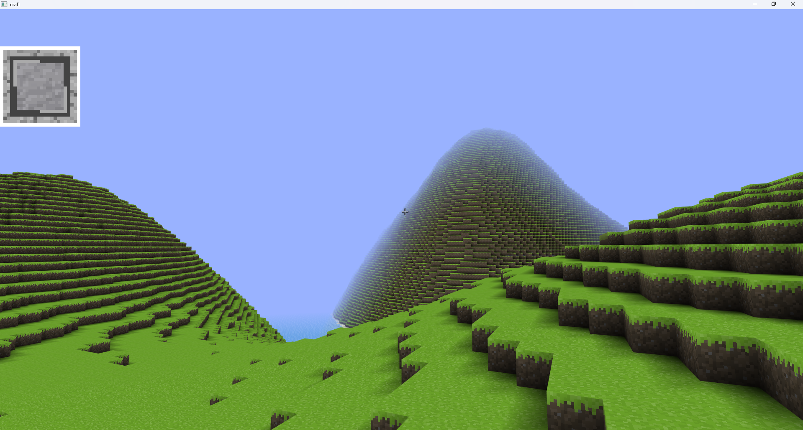

<div align="center">

# TextCraft

一个基于 C# 和 OpenTK 开发的 3D 体素游戏引擎

[](https://opensource.org/licenses/MIT)
[](https://dotnet.microsoft.com/)
[](https://docs.microsoft.com/en-us/dotnet/csharp/)

</div>

## 📖 项目简介

TextCraft 是一个使用 C# 开发的开源 3D 体素游戏引擎，灵感来源于 Minecraft。项目采用模块化设计，使用 OpenGL 进行渲染，旨在提供一个轻量、高性能的体素游戏开发框架。

## ✨ 特性

- 🎮 **体素世界渲染** - 基于区块（Chunk）的世界管理系统
- 🎨 **现代 OpenGL 渲染** - 使用 GLSL 着色器，支持纹理、环境光遮蔽（AO）
- 🖱️ **第一人称控制** - 完整的玩家移动和视角控制系统
- 🎯 **物理系统** - 基础的碰撞检测与物理模拟
- 📦 **资源管理** - 纹理、模型等资源的高效加载与管理
- 🔧 **模块化架构** - 清晰的代码结构，易于扩展和维护

## 🛠️ 技术栈

| 类别 | 技术 | 版本 |
|------|------|------|
| 语言 | C# | 10.0 |
| 框架 | .NET | 8.0 |
| 图形库 | OpenTK | 4.9.4 |
| 图像处理 | SixLabors.ImageSharp | 3.1.12 |
| 字符处理 | SixLabors.Font | 3.0.0 |

## 📁 项目结构
```
 TextCraft/
 ├── TextCraft/              # 主项目目录
 │   ├── src/
 │   │   ├── Core/           # 核心模块
 │   │   │   ├── ChunkModel/ # 区块模型
 │   │   │   ├── Config/     # 配置管理
 │   │   │   ├── Input/      # 输入系统
 │   │   │   ├── Physic/     # 物理系统
 │   │   │   ├── Game.cs     # 游戏主类
 │   │   │   ├── World.cs    # 世界管理
 │   │   │   └── ... 
 │   │   ├── Rendering/      # 渲染模块
 │   │   │   ├── BaseShader.cs
 │   │   │   ├── GameShader.cs
 │   │   │   ├── UIShader.cs
 │   │   │   ├── Grid.cs
 │   │   │   ├── GridMgr.cs
 │   │   │   └── IRenderer.cs
 │   │   ├── Table/          # 数据表
 │   │   │   ├── BlockTable.cs
 │   │   │   └── ModelTable.cs
 │   │   ├── Collections/    # 集合工具
 │   │   └── Tools/          # 工具类
 │   └── TextCraft.csproj    # 项目文件
 ├── TextCraft.sln           # 解决方案文件
 ├── LICENSE.txt             # 许可证
 └── README.md               # 项目说明
```
### 安装与运行

1. **克隆仓库**
```
git clone https://github.com/Xingkellh562/TextCraft.git
```

2. **还原依赖**
 ```
dotnet restore
 ```
3. **构建项目**
 ```
dotnet build --configuration Release
 ```
4. **运行游戏**
 ```
dotnet run --project TextCraft/TextCraft.csproj
```
5. **注意事项**

***首次编译完成后，请将项目目录下的RequiredResources文件夹中的所有文件，全部复制到编译输出目录（如 bin\debug\net8.0）否则会应找不到资源文件而报错。***

🎮 **操作说明**
 
| 按键 | 功能 |
|------|------|
| W / A / S / D  | 移动 |
| 鼠标 | 视角控制 |
| 空格 | 上升 |
| Shift | 下降 |
 
## 🗺️ 开发路线图
 
- 基础渲染框架(完成)
- 区块系统雏形(完成)
- 玩家控制系统(完成)
- 世界生成算法(完成)
- 方块放置与破坏(完成)
- 多纹理支持(完成)
- UI系统(开发中)
- 存档功能(开发中)
- 光照系统(开发中)
- 音效系统(计划中)
- 多人联机(计划中)

## 🖼️ 运行效果



## 🤝 贡献指南
 
欢迎提交 Issue 和 Pull Request！
 
1. Fork 本仓库

2. 创建你的特性分支 ( git checkout -b feature/AmazingFeature )

3. 提交你的更改 ( git commit -m 'Add some AmazingFeature' )

4. 推送到分支 ( git push origin feature/AmazingFeature )

5. 开启一个 Pull Request
 
## 📄 许可证
 
本项目采用 MIT 许可证 - 详见 LICENSE.txt 文件。
 
## 🙏 致谢
 
- OpenTK - .NET 平台的 OpenGL 绑定

- ImGui.NET - ImGui 的 .NET 封装

- SixLabors.ImageSharp - C# 图像处理库

- SixLabors.Font - C# 字符处理库